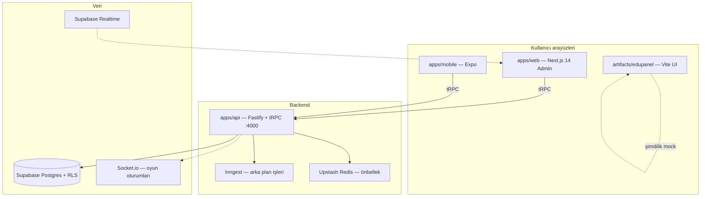

# Institute Platform — Proje Yol Haritası

> Dil okulları için çok kiracılı (multi-tenant) SaaS: program, saat takibi, uyarılar, vekil yönetimi, canlı sınıf oyunları.  
> Pilot okul: **Bright Minds Dil Okulu** (`brightminds` alt alan adı).

Son güncelleme: Haziran 2026

---

## İçindekiler

1. [Büyük resim](#büyük-resim)
2. [Repoda neler var?](#repoda-neler-var)
3. [Özellik durumu matrisi](#özellik-durumu-matrisi)
4. [Teknoloji özeti](#teknoloji-özeti)
5. [Geliştirme fazları](#geliştirme-fazları)
6. [Nerede geliştirebiliriz?](#nerede-geliştirebiliriz)
7. [Öncelik önerisi](#öncelik-önerisi)
8. [Komutlar](#komutlar)

---

## Büyük resim

Platform üç kullanıcı tipine hizmet eder:

| Rol | Ne yapar |
|-----|----------|
| **Admin** | Program, öğretmenler, saat onayı, uyarılar, vekil |
| **Öğretmen** | Derse giriş, saat kaydı, yoklama, rapor, oyun |
| **Öğrenci** | Canlı oyunlara katılma, skor ve ilerleme |

Hedef pazar: dil enstitüleri → önce pilot okul, sonra `okuladi.platform.com` alt alan adlarıyla SaaS satışı.



---

## Repoda neler var?

Monorepo: **pnpm workspaces** + **Turborepo**. İki paralel hat var: yeni PDF mimarisi (`apps/`, `packages/`) ve Replit dönemi (`artifacts/`, `lib/`).

### `apps/` — Üretim hedefi (PDF mimarisi)

| Klasör | Açıklama | Durum |
|--------|----------|--------|
| **`apps/api`** | Fastify + tRPC backend, port **4000** | Çalışır; Supabase yoksa mock veri |
| **`apps/web`** | Next.js 14 App Router admin, port **3000** | 4 sayfa + tRPC; UI sade |
| **`apps/mobile`** | Expo Router — öğretmen / öğrenci | İskelet; API health + özet ekran |

**API tRPC router’ları (mevcut):**

- `health.check` — sağlık kontrolü  
- `dashboard.summary` — günlük özet + bugünkü program + uyarılar  
- `teachers.list` — öğretmen listesi  
- `schedule.list` — haftalık program (Redis önbellek hazır)  
- `alerts.list` — uyarı listesi  

**API altyapı (kısmen):**

- Supabase admin client (`service_role` yalnızca API)  
- Upstash Redis — program önbelleği  
- Inngest — 15 dk’da bir attendance taraması (stub)  
- `AIService` — Claude için arayüz (henüz gerçek API yok)  
- `railway.toml` — Railway deploy şablonu  

---

### `packages/` — Paylaşılan kod

| Klasör | Açıklama | Durum |
|--------|----------|--------|
| **`packages/types`** | Zod şemaları: school, teacher, schedule, alert, dashboard, invitation | Tanımlı; API ile uyumlu |

---

### `supabase/` — Veritabanı

| Dosya | Açıklama | Durum |
|-------|----------|--------|
| **`migrations/20250601000000_initial_schema.sql`** | Tablolar, RLS, seed (Bright Minds) | Yazıldı; **henüz canlı projeye push edilmedi** |
| **`config.toml`** | Lokal Supabase CLI ayarı | Hazır |

**Tablolar:** `schools`, `profiles`, `teachers`, `students`, `classes`, `class_enrollments`, `schedule_slots`, `lesson_sessions`, `hour_logs`, `alerts`, `invitations`

**Güvenlik kuralları (şemada):** her tabloda `school_id`, RLS açık, davet süresi ≤ 72 saat, soft delete (`is_active`).

---

### `artifacts/` — Replit / prototip hattı

| Klasör | Açıklama | Durum |
|--------|----------|--------|
| **`artifacts/edupanel`** | React + Vite admin paneli (**EduPanel**) | **Tam UI** — 6 sayfa, shadcn, mock veri |
| **`artifacts/api-server`** | Express 5 + OpenAPI | Sadece `/healthz`; eski yol |
| **`artifacts/mockup-sandbox`** | UI bileşen önizleme | Geliştirme aracı |

**EduPanel sayfaları (mock, backend yok):**

| Sayfa | Route | İçerik |
|-------|-------|--------|
| Ana Sayfa | `/` | KPI kartları, bugünkü program, uyarılar |
| Program | `/program` | Haftalık grid, filtreler |
| Öğretmenler | `/ogretmenler` | Tablo, durum rozetleri |
| Saat Takibi | `/saat-takibi` | Saat onay akışı (mock) |
| Uyarılar | `/uyarilar` | Uyarı listesi |
| Ayarlar | `/ayarlar` | Okul ayarları (mock) |

---

### `lib/` — Eski API / DB hattı

| Klasör | Açıklama | Durum |
|--------|----------|--------|
| **`lib/api-spec`** | OpenAPI 3.1 spec | Yalnızca health |
| **`lib/api-zod`** | Orval ile üretilen Zod | Minimal |
| **`lib/api-client-react`** | React Query hooks (Orval) | EduPanel’e bağlı; kullanılmıyor |
| **`lib/db`** | Drizzle ORM | Şema **boş**; Supabase migration tercih edildi |

---

### Kök dosyalar

| Dosya | Amaç |
|-------|------|
| `turbo.json` | Turborepo görevleri |
| `pnpm-workspace.yaml` | Workspace + paket kataloğu |
| `INSTITUTE_PLATFORM.md` | Kurulum kılavuzu |
| `replit.md` | Replit çalıştırma notları |
| `ROADMAP.md` | Bu dosya |

---

## Özellik durumu matrisi

| Özellik | EduPanel (Vite) | Next.js (web) | API (tRPC) | Mobil (Expo) | Supabase |
|---------|-----------------|---------------|------------|--------------|----------|
| Dashboard özeti | Mock | tRPC | Mock/DB kısmi | Öğretmen özeti | Seed var |
| Haftalık program | Mock grid | Kart listesi | `schedule.list` | — | Tablo var |
| Öğretmen listesi | Mock | tRPC | `teachers.list` | — | Seed var |
| Saat takibi / onay | Mock UI | Yok | Yok | Yok | `hour_logs` tablosu |
| Uyarılar | Mock | tRPC | `alerts.list` | — | Seed var |
| Ayarlar | Mock | Yok | Yok | — | — |
| Auth / giriş | Yok | Yok | Header `x-school-id` | Aynı | RLS hazır |
| Multi-tenant subdomain | Yok | Yok | `school_id` middleware | — | `schools.subdomain` |
| Davet (72s) | Yok | Yok | Şema var | — | Constraint var |
| Geç giriş / no-show | Yok | Yok | Inngest stub | — | — |
| Canlı oyunlar | Yok | Yok | Yok | Placeholder | — |
| Öğrenci yönetimi | Yok | Yok | Yok | — | `students` tablosu |
| Raporlar / AI özet | Yok | Yok | AIService stub | — | — |

**Özet:** En zengin UI **EduPanel (Vite)**; en doğru mimari yol **apps/web + apps/api + Supabase**. İkisi henüz birleştirilmedi.

---

## Teknoloji özeti

| Katman | Hedef (PDF) | Repoda |
|--------|-------------|--------|
| Monorepo | Turborepo + pnpm | Var |
| Admin web | Next.js 14 | `apps/web` (kısmi) |
| Eski admin | — | `artifacts/edupanel` (tam mock) |
| API | Fastify + tRPC | `apps/api` |
| Eski API | — | `artifacts/api-server` (Express) |
| DB | Supabase + RLS | Migration hazır, bağlantı opsiyonel |
| Cache | Upstash Redis | Kod hazır, env gerekli |
| Jobs | Inngest | Cron stub |
| Mobil | Expo | İskelet |
| Deploy API | Railway | `railway.toml` |
| Deploy web | Vercel | Henüz config yok |
| Realtime | Supabase + Socket.io | Planlı, yok |

---

## Geliştirme fazları

### Faz 0 — Bugün (tamamlanan iskelet)

- [x] Turborepo + `apps/*` + `packages/types`  
- [x] Fastify + tRPC + mock fallback  
- [x] Supabase şema + RLS + seed SQL  
- [x] Next.js admin (4 sayfa, tRPC)  
- [x] Expo mobil iskelet  
- [x] Redis / Inngest / Railway / AIService iskelet  
- [x] EduPanel tam mock UI (Vite)  

### Faz 1 — Temel entegrasyon (1–2 hafta)

**Amaç:** Mock’tan çıkıp tek gerçek veri kaynağı.

- [ ] Supabase projesi oluştur, migration uygula  
- [ ] `apps/api/.env` — `SUPABASE_*`, test et  
- [ ] `schedule_slots` seed veya admin CRUD  
- [ ] Supabase Auth + `profiles` — admin girişi  
- [ ] `x-school-id` yerine JWT’den `school_id`  
- [ ] Next.js: Saat Takibi + Ayarlar sayfalarını EduPanel’den taşı  
- [ ] EduPanel’i emekli et **veya** tRPC’ye bağla (tek frontend seç)  

### Faz 2 — Admin iş akışları (2–4 hafta)

**Amaç:** Kırmızı dosya + kağıt programın dijital karşılığı.

- [ ] Program: haftalık grid (EduPanel UI → Next.js)  
- [ ] Ders ekle / düzenle / iptal (`schedule` mutations)  
- [ ] Saat takibi: öğretmen log → admin onay (`hour_logs`)  
- [ ] Uyarılar: çözüldü işaretle, filtre, Realtime push  
- [ ] Öğretmen CRUD + davet e-postası (72s token)  
- [ ] Vekil atama akışı (`substitute_needed` → yeni slot)  
- [ ] Upstash: program önbelleği invalidation  

### Faz 3 — Öğretmen & öğrenci mobil (3–5 hafta)

**Amaç:** Sınıf içi ve dışı günlük kullanım.

- [ ] Öğretmen: derse check-in, saat girişi  
- [ ] Öğretmen: yoklama, kısa rapor  
- [ ] Öğrenci: oyun lobisine katılma  
- [ ] Push bildirimleri (Expo Notifications)  
- [ ] Offline-tolerant saat kaydı (kuyruk)  

### Faz 4 — Oyunlar & realtime (4–6 hafta)

**Amaç:** PDF’teki Socket.io + oyun oturumları.

- [ ] Socket.io sunucusu (`apps/api` veya ayrı servis)  
- [ ] Oyun state Redis’te  
- [ ] Öğrenci skor tablosu  
- [ ] Supabase Realtime — uyarı kanalı  

### Faz 5 — SaaS & ölçek (6+ hafta)

**Amaç:** İkinci okula satış.

- [ ] Subdomain routing (`brightminds.platform.com`)  
- [ ] Okul kayıt / faturalandırma (Stripe)  
- [ ] Süper admin paneli  
- [ ] Anthropic: rapor özeti, vekil önerisi  
- [ ] Railway (API) + Vercel (web) CI/CD  
- [ ] E2E testler, gözlemlenebilirlik (Sentry, log aggregation)  
- [ ] `lib/db` / Express / OpenAPI hattını kaldır (tek API: tRPC)  

---

## Nerede geliştirebiliriz?

### Backend (`apps/api`)

| Konu | Ne yapılabilir | Öncelik |
|------|----------------|---------|
| **Mutations** | `teachers.create`, `schedule.upsert`, `alerts.resolve`, `hours.approve` | Yüksek |
| **Auth middleware** | Supabase JWT doğrulama, rol kontrolü | Yüksek |
| **Inngest** | Geç giriş / no-show → otomatik `alerts` kaydı | Yüksek |
| **Davet sistemi** | E-posta + token hash + süre kontrolü | Orta |
| **Socket.io** | Canlı oyun odaları | Orta |
| **AIService** | Claude SDK, rapor özeti | Düşük |
| **Rate limit** | Okul başına API limiti | Düşük |
| **Testler** | tRPC procedure unit + integration | Orta |

### Veritabanı (`supabase/`)

| Konu | Ne yapılabilir | Öncelik |
|------|----------------|---------|
| **Migration v2** | `game_sessions`, `attendance`, `reports` tabloları | Orta |
| **RLS testleri** | Okullar arası veri sızıntısı testi | Yüksek |
| **Realtime** | `alerts` için publication | Orta |
| **Edge functions** | Davet e-postası, webhooks | Düşük |

### Admin web (`apps/web`)

| Konu | Ne yapılabilir | Öncelik |
|------|----------------|---------|
| **UI parity** | EduPanel tasarımını Next’e taşı (shadcn) | Yüksek |
| **Eksik sayfalar** | Saat Takibi, Ayarlar | Yüksek |
| **Auth UI** | Supabase Auth login / magic link | Yüksek |
| **Formlar** | react-hook-form + Zod (`packages/types`) | Orta |
| **Realtime uyarı** | Supabase client subscribe | Orta |
| **Vercel deploy** | `vercel.json`, preview env | Orta |

### EduPanel (`artifacts/edupanel`)

| Seçenek | Açıklama |
|---------|----------|
| **A — Emekli** | Sadece `apps/web` geliştirilir |
| **B — Köprü** | tRPC client eklenir; hızlı demo |
| **C — Referans** | Tasarım kaynağı olarak kalır |

### Mobil (`apps/mobile`)

| Konu | Ne yapılabilir | Öncelik |
|------|----------------|---------|
| **Auth** | Supabase Auth (mobil) | Yüksek |
| **Öğretmen akışı** | Check-in, saat, yoklama | Yüksek |
| **Öğrenci oyunları** | Socket.io client | Orta |
| **Deep link** | Davet / sınıf kodu | Orta |
| **Biyometrik** | Hızlı giriş | Düşük |

### DevOps & kalite

| Konu | Ne yapılabilir |
|------|----------------|
| GitHub Actions | `typecheck`, `build`, migration check |
| Ortamlar | `dev` / `staging` / `prod` Supabase |
| Gizli anahtarlar | Railway + Vercel env |
| Dokümantasyon | tRPC procedure listesi (OpenAPI yerine) |

### Teknik borç / temizlik

| Konu | Aksiyon |
|------|---------|
| `artifacts/api-server` (Express) | Kullanılmıyorsa sil veya arşivle |
| `lib/api-spec` + Orval | tRPC’ye geçince kaldır |
| `lib/db` Drizzle | Supabase tek kaynak ise kaldır |
| İki admin paneli | Tekine karar ver |
| `pnpm` SSL (Windows) | Kurumsal proxy / sertifika düzeltmesi |

---

## Öncelik önerisi

Kısa vadede en çok değer üreten sıra:

1. **Supabase’i canlıya al** → migration + env  
2. **Auth** → admin girişi, JWT → `school_id`  
3. **Next.js UI** → EduPanel sayfalarını tRPC ile birleştir  
4. **Saat onayı + uyarı çözme** → gerçek iş akışı  
5. **Inngest** → geç giriş otomasyonu  
6. **Mobil öğretmen** → check-in  
7. **Oyunlar** → Socket.io + öğrenci ekranı  
8. **Multi-tenant SaaS** → subdomain + billing  

---

## Komutlar

```bash
# Yeni stack (önerilen)
pnpm install
pnpm dev              # API :4000 + Next.js :3000
pnpm dev:mobile       # Expo
pnpm dev:edupanel     # Eski Vite mock UI

# Tek parça
pnpm dev:api
pnpm dev:web

# Kalite
pnpm run typecheck
pnpm run build
```

| URL | Servis |
|-----|--------|
| http://localhost:3000 | Next.js admin |
| http://localhost:4000/healthz | API health |
| http://localhost:4000/trpc | tRPC |

---

## GitHub Workflow (ekip)

| Madde | Dosya |
|-------|--------|
| Branch kuralları, PR akışı | [`docs/GITHUB_WORKFLOW.md`](./docs/GITHUB_WORKFLOW.md) |
| Katkı / commit | [`CONTRIBUTING.md`](./CONTRIBUTING.md) |
| Daily sync şablonu | [`docs/daily-sync/TEMPLATE.md`](./docs/daily-sync/TEMPLATE.md) |
| Remote kurulum | [`scripts/setup-github-remote.ps1`](./scripts/setup-github-remote.ps1) |
| Branch protection (partner) | [`.github/BRANCH_PROTECTION.md`](./.github/BRANCH_PROTECTION.md) |

---

## İlgili dosyalar

- Kurulum: [`INSTITUTE_PLATFORM.md`](./INSTITUTE_PLATFORM.md)  
- Replit notları: [`replit.md`](./replit.md)  
- Veritabanı: [`supabase/migrations/20250601000000_initial_schema.sql`](./supabase/migrations/20250601000000_initial_schema.sql)  
- API giriş: [`apps/api/src/index.ts`](./apps/api/src/index.ts)  
- tRPC router: [`apps/api/src/routers/index.ts`](./apps/api/src/routers/index.ts)  
- Zod tipleri: [`packages/types/src/index.ts`](./packages/types/src/index.ts)  

---

*Bu yol haritası canlı bir belgedir. Her büyük özellik tamamlandığında ilgili fazdaki kutuları işaretleyin.*
